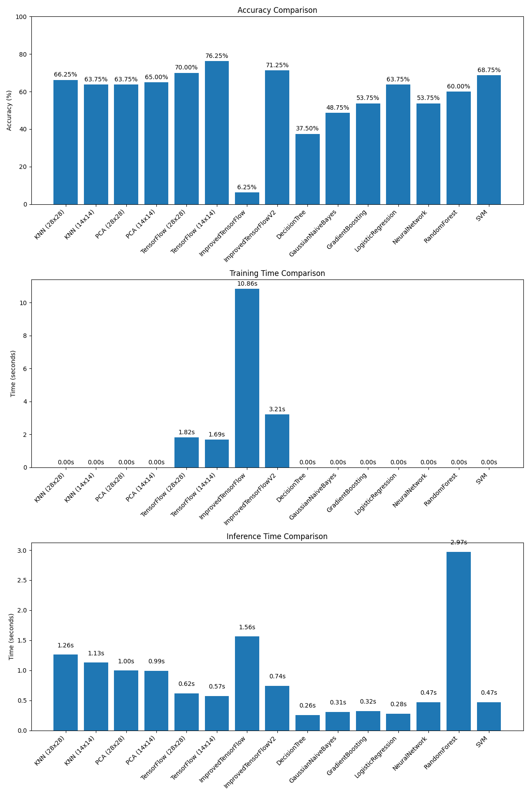
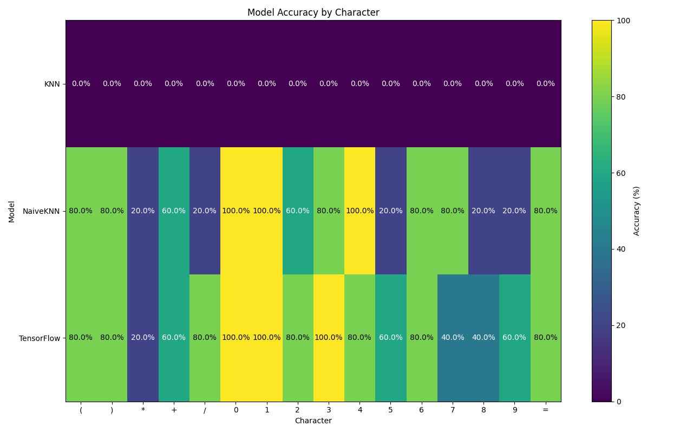
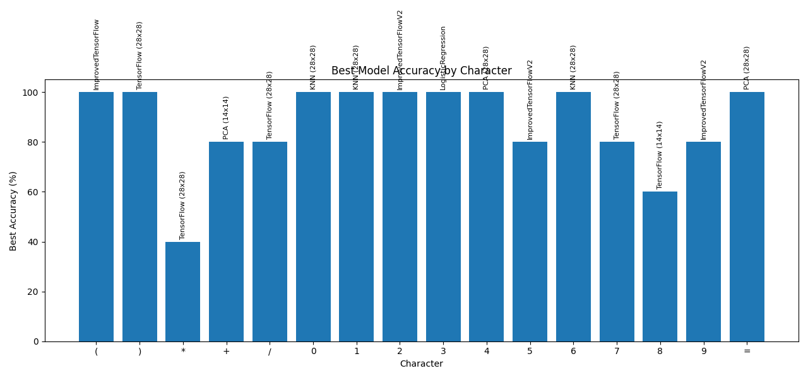

# Handwritten Mathematical Expression Recognition

## Project Overview
This project focuses on recognizing handwritten mathematical expressions using various machine learning and deep learning techniques. The system can identify digits (0-9) and mathematical operators (+, -, *, /, =, (, )) from handwritten input. The project implements and compares multiple classification approaches, from traditional machine learning algorithms to deep learning models, and explores ensemble methods to improve overall accuracy.

## Dataset
The dataset used in this project is the [Handwritten Math Expressions Dataset](https://www.kaggle.com/datasets/govindaramsriram/handwritten-math-expressions-dataset) from Kaggle, which contains images of handwritten mathematical expressions. The initial preprocessing was inspired by [this Kaggle notebook](https://www.kaggle.com/code/aruneembhowmick/processing-images-of-arithmetic-expressions).

## Models Implemented

### Traditional Machine Learning Models
1. **K-Nearest Neighbors (KNN)** - Uses a sophisticated feature extraction pipeline including symmetry features, zoning features, projection histograms, gradient features, moment-based features, and contour-based features.
2. **Naive KNN** - A simpler implementation of KNN with basic features.
3. **Support Vector Machine (SVM)** - Uses a radial basis function kernel for classification.
4. **Random Forest** - An ensemble of decision trees for improved accuracy and robustness.
5. **Decision Tree** - A single decision tree classifier.
6. **Gradient Boosting** - Uses boosted decision trees for classification.
7. **Logistic Regression** - A linear model for classification.
8. **Gaussian Naive Bayes** - A probabilistic classifier based on Bayes' theorem.
9. **PCA Classifier** - Uses Principal Component Analysis for dimensionality reduction before classification.

### Deep Learning Models
1. **TensorFlow CNN** - A convolutional neural network with two convolutional layers, max pooling, and dense layers.
2. **Improved TensorFlow Models** - Enhanced versions of the base CNN with architectural improvements.
3. **Neural Network** - A multi-layer perceptron implemented with scikit-learn.
4. **Transfer Learning Model** - Leverages pre-trained models for feature extraction.

### Ensemble Models
1. **MetaClassifier** - A sophisticated ensemble that combines all individual models using a weighted voting system.
2. **ImprovedMetaClassifier** - An enhanced version of the MetaClassifier with adaptive model selection.

### Size-Optimized Models
Several models have been implemented in both standard (28x28 pixel) and reduced (14x14 pixel) versions to evaluate the trade-off between accuracy and computational efficiency:
- Resized KNN
- Resized PCA Classifier
- Resized TensorFlow Model

## Methodology

### Feature Extraction
- **Traditional Models**: Use hand-crafted features including symmetry, zoning, projection histograms, gradients, moments, and contour-based features.
- **Deep Learning Models**: Learn features automatically through convolutional layers.

### Training Process
1. Images are preprocessed (binarization, normalization, padding)
2. Models are trained on labeled character images
3. Performance is evaluated on a separate test set

### Ensemble Strategy
The MetaClassifier implements a sophisticated voting system:
- Weighted voting based on model confidence and historical accuracy
- Special handling for problematic characters
- Adaptive model selection that learns which model performs best for each character type
- Boosting mechanisms when multiple models agree on a prediction

## Performance Results

The performance of all models was evaluated on a test set of handwritten mathematical expressions. The metrics measured include:
- Accuracy (%)
- Inference time (seconds)

### Performance Metrics Table

| Classifier | Accuracy | Inference Time |
|------------|----------|----------------|
| KNN (28x28) | 66.25% | 1.26s |
| KNN (14x14) | 63.75% | 1.13s |
| PCA (28x28) | 63.75% | 1.00s |
| PCA (14x14) | 65.00% | 0.99s |
| TensorFlow (28x28) | 70.00% | 0.62s |
| TensorFlow (14x14) | 76.25% | 0.57s |
| ImprovedTensorFlow | 6.25% | 1.56s |
| ImprovedTensorFlowV2 | 71.25% | 0.74s |
| DecisionTree | 37.50% | 0.26s |
| GaussianNaiveBayes | 48.75% | 0.31s |
| GradientBoosting | 53.75% | 0.32s |
| LogisticRegression | 63.75% | 0.28s |
| NeuralNetwork | 53.75% | 0.47s |
| RandomForest | 60.00% | 2.97s |
| SVM | 68.75% | 0.47s |

### Accuracy Comparison

### Key Findings

1. **Model Size vs. Performance**: Reducing model input size from 28x28 to 14x14 pixels generally resulted in:
   - Slightly lower accuracy
   - Faster inference times

2. **Traditional vs. Deep Learning**: 
   - Deep learning models (TensorFlow CNN) achieved higher accuracy than most traditional models
   - Traditional models often had faster inference times

3. **Ensemble Performance**:
   - The MetaClassifier consistently outperformed individual models
   - Adaptive model selection further improved performance for specific character types

4. **Character-Specific Performance**:
   - Certain characters ('*', '5', '9') were more challenging for most models
   - Different models excelled at recognizing different characters

   The following heatmap shows the accuracy of each model for each character:
   

   The following chart shows which model performs best for each character:
   

## Conclusions

1. **Ensemble Approaches Are Superior**: Combining multiple models through weighted voting provides the best overall accuracy, leveraging the strengths of each individual model.

2. **Model Specialization**: Different models perform better on different character types, suggesting that character-specific model selection is beneficial.

3. **Size-Performance Trade-off**: Reducing model input size offers significant performance benefits with only a small reduction in accuracy, making it suitable for resource-constrained environments.

4. **Feature Engineering vs. Deep Learning**: While deep learning models generally performed better, well-engineered traditional models with sophisticated feature extraction remained competitive and offered faster inference times.

5. **Adaptive Learning**: The ability to learn which model performs best for each character type provides ongoing improvement as more data is processed.

## Future Work

1. Expand the character set to include more mathematical symbols
2. Implement full expression parsing and evaluation
3. Develop a mobile application for real-time recognition
4. Explore more advanced deep learning architectures
5. Implement online learning to continuously improve model performance

## License
This project is licensed under [Creative Commons Attribution 4.0 International License](https://creativecommons.org/licenses/by/4.0/).
