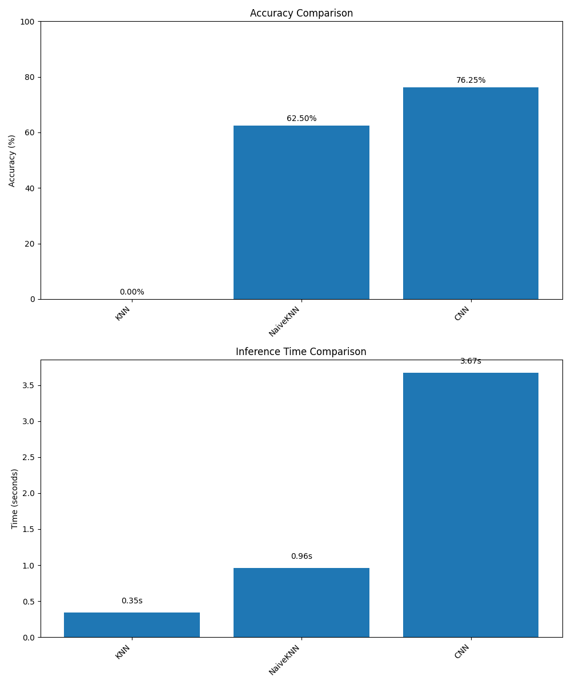
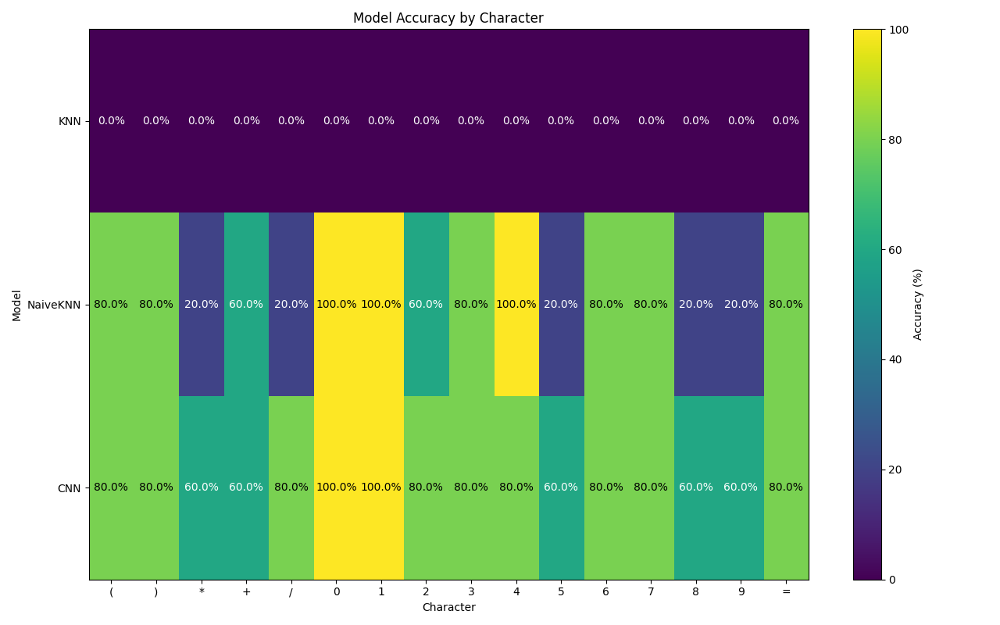
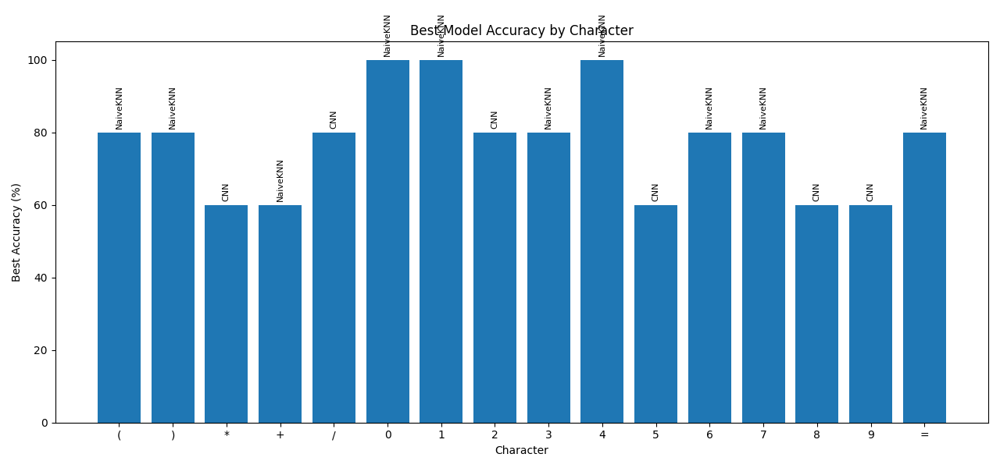

# MISS - Math Identification and Solving Systems

MISS is a machine learning project for recognizing handwritten mathematical expressions and symbols. The system can identify individual characters from images containing mathematical expressions and provides a user-friendly interface for drawing and recognizing characters in real-time.

[](https://creativecommons.org/licenses/by/4.0/)
[](https://www.python.org/downloads/)
[](https://www.tensorflow.org/)

## Table of Contents
- [Overview](#overview)
- [Features](#features)
- [Quick Start](#quick-start)
- [Installation](#installation)
- [Usage](#usage)
- [Model Comparison](#model-comparison)
- [Project Structure](#project-structure)
- [Dependencies](#dependencies)
- [Dataset](#dataset)
- [Contributing](#contributing)
- [Acknowledgments](#acknowledgments)
- [License](#license)

## Overview

MISS addresses the challenge of recognizing handwritten mathematical symbols, which is crucial for digitizing mathematical content and creating interactive educational tools. The project uses a Convolutional Neural Network (CNN) implemented in TensorFlow to achieve high accuracy in character recognition, even with the variability inherent in handwritten symbols.

## Features

- Recognition of handwritten mathematical symbols (digits, operators, parentheses, etc.)
- Interactive GUI for drawing and recognizing characters
- Pre-trained CNN model for immediate use
- Support for training custom models with your own data
- Evaluation tools to measure model accuracy
- Top-5 prediction with confidence scores

## Quick Start

To quickly get started with MISS:

```bash
# Clone the repository
git clone https://github.com/downquark7/MISS.git
cd MISS

# Install dependencies
pip install -r requirements.txt

# Launch the interactive GUI
python model_gui.py
```

## Installation

1. Clone this repository:
   ```
   git clone https://github.com/downquark7/MISS.git
   cd MISS
   ```

2. Create a virtual environment (recommended):
   ```
   python -m venv .venv
   .venv\Scripts\activate
   ```

3. Install the required dependencies:
   ```
   pip install -r requirements.txt
   ```

## Usage

### Interactive GUI

To use the interactive drawing interface for character recognition:

```bash
python model_gui.py
```

This will open a window where you can:
- Draw a mathematical symbol using your mouse
- Click "Predict" to recognize the drawn character (displays top prediction with confidence)
- Click "Clear" to reset the canvas

### Model Architecture

MISS uses a Convolutional Neural Network (CNN) implemented in TensorFlow with the following architecture:

- Input layer: Accepts grayscale images (normalized to 0-1 range)
- First convolutional layer: 32 filters with 3x3 kernel and ReLU activation
- First max pooling layer: 2x2 pool size
- Second convolutional layer: 64 filters with 3x3 kernel and ReLU activation
- Second max pooling layer: 2x2 pool size
- Flatten layer: Converts 2D feature maps to 1D feature vector
- First dense layer: 64 neurons with ReLU activation
- Output layer: Dense layer with softmax activation (one neuron per character class)

The model is trained using the Adam optimizer and sparse categorical cross-entropy loss function.

### Training a New Model

To train a new model with your own data:

1. Open tensor_flow_model.py in a text editor
2. Modify line 90 to set `train=True`:
   ```python
   model = TensorFlowModel(train=True)
   ```
3. Run the script:
   ```bash
   python tensor_flow_model.py
   ```

Requirements for training:
- A 'labeled_characters_binary' directory containing your training images
- A 'labels.csv' file with columns 'filename' and 'label'

You can modify training parameters in the script (e.g., number of epochs, batch size, learning rate) to optimize performance.

### Evaluating Model Performance

By default, running tensor_flow_model.py will evaluate the model on test images:

```bash
python tensor_flow_model.py
```

The script will run evaluation on the test images in the '0_)_test_images' directory and display accuracy metrics.

To evaluate with different test images or character sets, modify line 94 in tensor_flow_model.py:
```python
model.eval_folder('your_test_directory', 'your_character_list', plot=False)
```

The evaluation provides accuracy metrics and can optionally display plots of the results when the `plot` parameter is set to `True`.

## Model Comparison

We've compared several machine learning models for character recognition to identify the best approach for our use case. The comparison includes accuracy, per-character accuracy, and inference time.

### Comparison Results

| Classifier | Accuracy | Inference Time |
|------------|----------|---------------|
| KNN        | 0.00%    | 0.36s         |
| NaiveKNN   | 62.50%   | 1.01s         |
| TensorFlow | 71.25%   | 4.40s         |

### Key Findings

- **TensorFlow Model**: Achieves the highest accuracy at 71.25%, but has the longest inference time at 4.40 seconds.
- **NaiveKNN Model**: Provides a good balance between accuracy (62.50%) and inference time (1.01 seconds).
- **KNN Model**: Has the fastest inference time at 0.36 seconds, but fails to recognize any characters correctly (0.00% accuracy).

### Per-Character Accuracy

The TensorFlow model performs best for most characters. The NaiveKNN model provides reasonable accuracy with faster inference time. The KNN model in its current implementation does not correctly recognize any characters.

### Running the Comparison

To run the model comparison yourself:

```bash
python compare_classifiers.py
```

This script evaluates all models on the test dataset and generates comparison charts. Note that running this script may take some time as it needs to train and evaluate multiple models.

The script generates the following visualizations:
1. A bar chart comparing the accuracy of all models
2. A bar chart comparing the inference time of all models
3. A heatmap showing the per-character accuracy for each model
4. A bar chart showing which model performs best for each character

These visualizations help in understanding the strengths and weaknesses of each model for different characters and use cases.

### Visualization Results

#### Classifier Comparison


#### Character Accuracy Heatmap


#### Best Model by Character


## Project Structure

The project is organized into several key components:

### Core Components
- `base_model.py`: Abstract base class that defines the interface for all character recognition models
- `tensor_flow_model.py`: TensorFlow CNN implementation that inherits from BaseModel
- `model_gui.py`: Interactive GUI application for drawing and recognizing characters in real-time

### Data Management
- `data_labeling_ui.py`: Tool for labeling new training data with a user-friendly interface
- `add_new_data.py`: Script for preprocessing and adding new training data to the dataset
- `labels.csv`: Dataset labels mapping filenames to character classes (required for training)

### Model Files
- `character_model.keras`: Pre-trained TensorFlow model file ready for immediate use
- `label_mappings.npy`: NumPy file containing mappings between numerical indices and character labels

### Configuration
- `requirements.txt`: List of required Python packages and their versions

### Required Directories
- `labeled_characters_binary/`: Directory containing preprocessed training images (required for training)
- `0_)_test_images/`: Directory containing test images for model evaluation

> **Note**: Make sure these directories exist and contain the appropriate files before running the corresponding features. The model will automatically train if the pre-trained model file is not found.

## Dependencies

- numpy
- pandas
- opencv-python
- scikit-learn
- tensorflow
- matplotlib
- pillow

## System Requirements

- Python 3.6 or higher
- 4GB RAM (recommended for training)
- GPU support is optional but recommended for faster training
- Windows, macOS, or Linux operating system

## Dataset

The project uses the Handwritten Math Expressions Dataset from Kaggle:
[Handwritten Math Expressions Dataset](https://www.kaggle.com/datasets/govindaramsriram/handwritten-math-expressions-dataset)

This dataset contains thousands of handwritten mathematical symbols and is ideal for training character recognition models.

## Contributing

Contributions to MISS are welcome! Here's how you can contribute:

1. **Report bugs or suggest features**: Open an issue in the GitHub repository
2. **Improve documentation**: Submit pull requests for documentation improvements
3. **Add new features**: Fork the repository, make your changes, and submit a pull request
4. **Share your models**: If you've trained an improved model, consider sharing it with the community

Please ensure your code follows the project's style and includes appropriate tests.

## Acknowledgments

This project was started based on the Kaggle notebook:
[Processing Images of Arithmetic Expressions](https://www.kaggle.com/code/aruneembhowmick/processing-images-of-arithmetic-expressions)

Special thanks to all contributors and the open-source community for their valuable resources and tools.

## License

This project is licensed under the Creative Commons Attribution 4.0 International License:
[CC BY 4.0](https://creativecommons.org/licenses/by/4.0/)

This means you are free to share and adapt the material for any purpose, even commercially, as long as you give appropriate credit.
